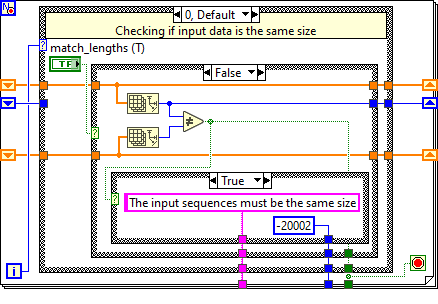
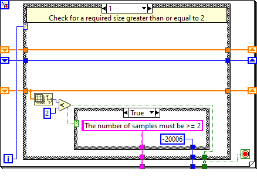
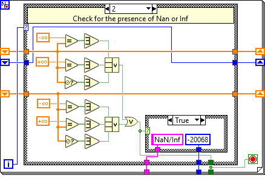
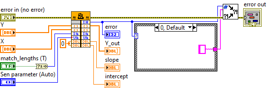

# Theil-Sen


[](https://doi.org/10.5281/zenodo.21399286)\
Theil–Sen estimator (the repeated median regression of Siegel) for LabVIEW 2021 SP1

More information about this method can be found here: [Theil–Sen](https://en.wikipedia.org/wiki/Theil%E2%80%93Sen_estimator) and [regression of Siegel](https://academic.oup.com/biomet/article-abstract/69/1/242/243029)

Using `example.vi,` you can test the operation of `Theil-Sen.vi.` Here's an example:


You can choose one of three "Sen parameter" options: **Auto** – automatic checking for duplicate X values, **On** – duplicate checking is always enabled, and **Off** – checking is disabled (choose only if you are sure that the values ​​of array X do not repeat).


Also, checking for array length equality is enabled by default. It's best to leave it enabled.\
Checks have been added to the `Theil-Sen.vi` file.





Creating a program in `C++` and `LabVIEW_TheilSen.dll`. A wrapper for the dll `Dll wrapper.vi` has been created.



Using the file `example_2.vi`, you can check the running time of the file `Theil-Sen.vi`, with the **Auto** and **On** parameters, and also using the `LabVIEW_TheilSen.dll` library.

## How to Build the DLL

This project uses **CMake**. To compile the `LabVIEW_TheilSen.dll` on your machine:

1. Ensure you have a C++ compiler installed (MinGW-w64 or MSVC x64) and **CMake** (built into CLion / Visual Studio).
2. Open `CMakeLists.txt` and verify the path to your LabVIEW `cintools` directory:
   ```cmake
   if(EXISTS "C:/Program Files/National Instruments/LabVIEW 2021/cintools")
    set(LABVIEW_CINTOOLS "C:/Program Files/National Instruments/LabVIEW 2021/cintools")
   ```
   *If you are using a different version of LabVIEW, simply update this path to point to your `cintools` folder.*
3. Switch the build configuration to **Release** mode.
4. Run the build command (<kbd>Ctrl</kbd> + <kbd>F9</kbd> in CLion or `cmake --build . --config Release` via terminal).
5. The compiled, fully standalone `LabVIEW_TheilSen.dll` will be generated in your release folder.
