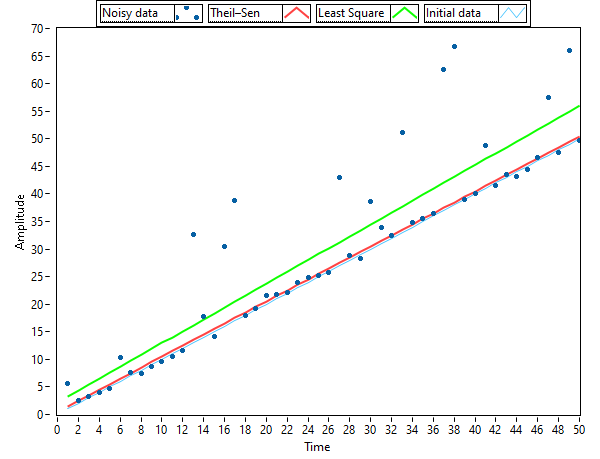
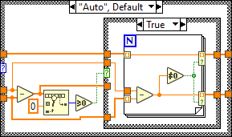

# Theil-Sen
Theil–Sen estimator for LabVIEW 2021 SP1

Сan read about this method [here](https://en.wikipedia.org/wiki/Theil%E2%80%93Sen_estimator)

Using "example.vi," you can test the operation of "Theil-Sen.vi." Here's an example:

You can choose one of three "Sen parameter" options: "Auto" – automatic checking for duplicate X values, "On" – duplicate checking is always enabled, and "Off" – checking is disabled.

Also, checking for array length equality is enabled by default. It's best to leave it enabled.
Added files for LabVIEW 2010 in a separate folder.
